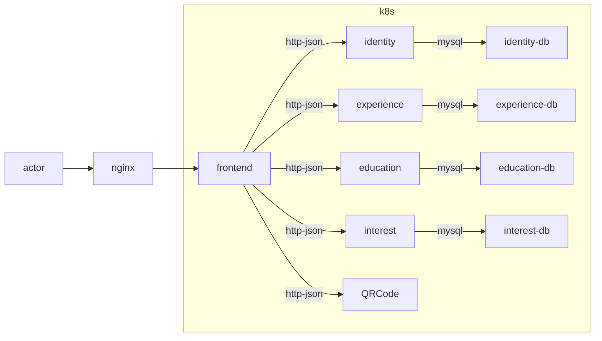

# CV

Writing a CV is boring... so I tricked myself into doing it by doing this...

## Architecture

## Makefile Targets

The repository includes a `Makefile` that automates common tasks:

- **install** – Install all required tooling (k3d, kubectl, Helm, Helmfile, kubectl‑validate).
- **provision** – Run the Ansible playbook to provision infrastructure.
- **setup** – Install `buf` for protobuf generation.
- **proto** – Generate Go code from the protobuf definitions.
- **lint** – Run `golangci-lint` against all backend packages.
- **clean** – (Not yet implemented) Clean generated files and binaries.

Feel free to run `make -p` to see the full list of available targets.

