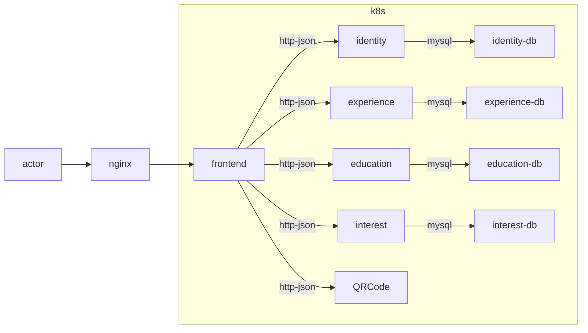

# CV

Writing a CV is boring... so I tricked myself into doing it by doing this...

## Architecture

```mermaid
graph LR
    actor --> nginx --> frontend

    subgraph k8s
        frontend -->|http-json| identity   -->|mysql| identity-db
        frontend -->|http-json| experience -->|mysql| experience-db
        frontend -->|http-json| education  -->|mysql| education-db
        frontend -->|http-json| interest   -->|mysql| interest-db
        frontend -->|http-json| QRCode
    end

```

