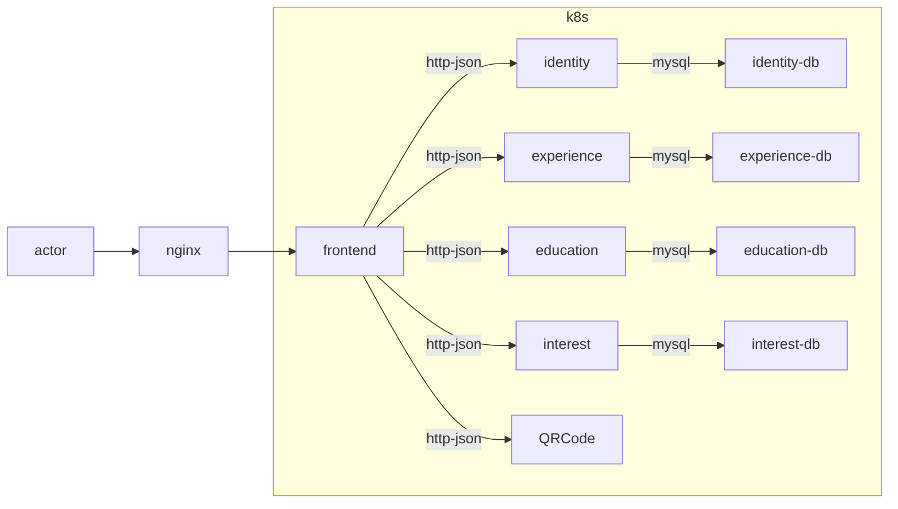

# CV

Writing a CV is boring... so I tricked myself into doing it by doing this...

## Architecture



## Deployment Process

### Development Environment

Local development uses a k3d cluster with a local container registry (`registry:5000`). To build and load images locally:

```bash
# Build all backend services
./scripts/make_images.sh

# The script builds images with the cv-{service} prefix and loads them into the local registry
# Images are tagged as :latest for development
```

After building, run `make provision` to start a k3d cluster and deploy the applications using Helmfile.

### Production Environment

Production images are built and pushed to GitHub Container Registry (GHCR) via GitHub Actions:

1. **Build Process**: GitHub Actions workflows compile each backend service and frontend
2. **Registry**: Images are pushed to `ghcr.io/daniellawrence/cv-{service}:master`
3. **Versioning**: Production images use the `master` tag for all services

### GitOps with ArgoCD

Both development and production deployments are managed by an ArgoCD instance running in the cluster:

- **ArgoCD Application Sets** monitor GitHub repositories for changes
- **Automatic Sync**: When new images are built and pushed, ArgoCD automatically syncs the cluster
- **Environment Separation**: Separate ArgoCD applications for dev and production environments
- **Self-healing**: Applications continuously reconcile to maintain desired state

The ArgoCD instance is deployed via Helmfile and manages all backend services, frontend, and infrastructure components including Jaeger for observability.

## Makefile Targets

The repository includes a `Makefile` that automates common tasks:

- **install** – Install all required tooling (k3d, kubectl, Helm, Helmfile, kubectl‑validate).
- **provision** – Run the Ansible playbook to provision infrastructure.
- **setup** – Install `buf` for protobuf generation.
- **proto** – Generate Go code from the protobuf definitions.
- **lint** – Run `golangci-lint` against all backend packages.
- **clean** – (Not yet implemented) Clean generated files and binaries.

Feel free to run `make -p` to see the full list of available targets.
